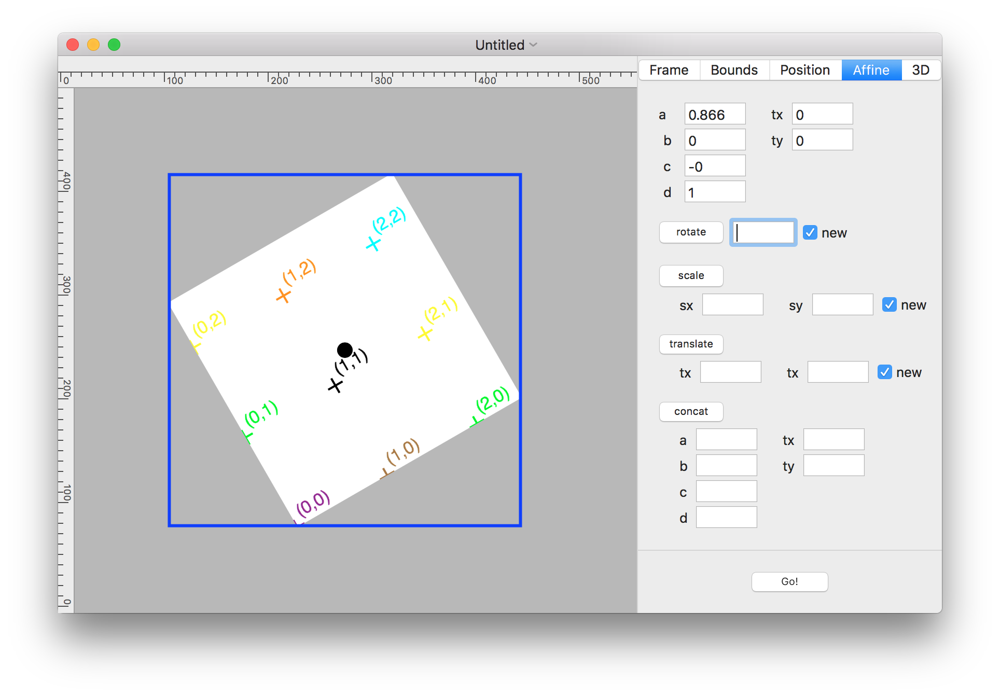

# Layer Explorer

An OS X app for visualizing and exploring CALayer geometry.

An inspector sidebar show and allows editing of CALayer geometry properties, and changes are animated.

The layer's bounds is visualized with labeled hashed for the coordinate system, allowing bounds changes to be visualized.

The frame is outlined, showing how the bounds and transform translate to the superlayer; and the anchorPoint is shown with a dot.

### iOS Notes

The layer's origin is different on OS X than on iOS. OS X has the origin at the bottom left, while iOS has it at the top left.

### Screenshot

### ToDo List and Brainstorming

* Turn inspector sidebar into vertile panes, like in Xcode.
* Show editing history; add undo and replay.
* Allow scrolling of canvas and show rulers.
* Add tools: drag-and-drop layer, scroll canvas, etc.
* Add multiple-layer support.
